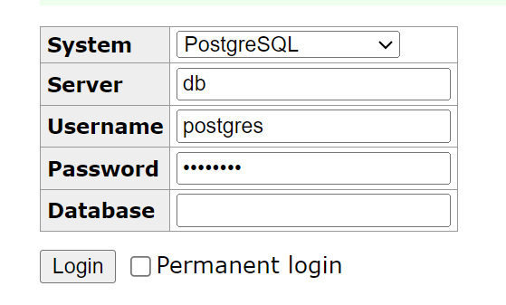

# Connect to a PostgreSQL Locally

To connecet our database locally we need to have the [Docker](https://docs.docker.com/engine/install/) installed in our system.

Once docker is installed in our system then we will add a file `docker-compose.yml` in our root project with the below snippet.

```yaml
version: "3.1"
services:
  db:
    image: postgres:alpine
    restart: always
    environment:
      POSTGRES_PASSWORD: "postgres"
    ports:
      - "5432:5432"
  adminer:
    image: adminer
    restart: always
    ports:
      - 8080:8080
```

Then will run the container with the below command

```sh
docker compose up
```

And once it is done then we can access our database locally from http://localhost:8080 server.

Once it is open then we will open http://localhost:8080 to see our datatbase. Below are the local credentials.

```sh
User: postgres
Password: postgres
```



Then we will create a database by clicking the below link


Then we will add `@cap-js/postgres` to our project using below command.

```sh
npm add @cap-js/postgres
```

Then Add the local database information in the package.json:

```json
    "cds": {
        "requires": {
            "db": {
                "kind": "postgres",
                "impl": "@cap-js/postgres",
                "credentials": {
                    "host": "localhost",
                    "port": 5432,
                    "database": "bookshop-xyz",
                    "user": "postgres",
                    "password": "postgres"
                }
            }
        }
    }
```

> The credentials can be configured in ~/.cdsrc.json or .env file.
> For example, in .env:
>
> ```
> cds.requires.db.credentials.host = localhost
> cds.requires.db.credentials.port = 5432
> cds.requires.db.credentials.user = postgres
> cds.requires.db.credentials.password = postgres
> cds.requires.db.credentials.database = bookshop-xyz
> ```
>
> For example, in ~/.cdsrc.json:
>
> ```json
> {
>   "requires": {
>     "db": {
>       "credentials": {
>         "host": "localhost",
>         "port": 5432,
>         "user": "postgres",
>         "password": "postgres",
>         "database": "bookshop-xyz"
>       }
>     }
>   }
> }
> ```

Here we have used the .env approach.

Then we use `cds deploy` command we will see that the data is deployed in `postgres` and we can see the data.

